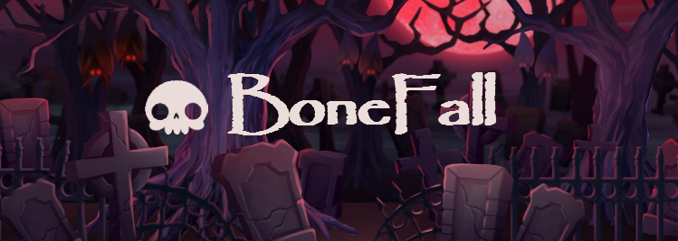
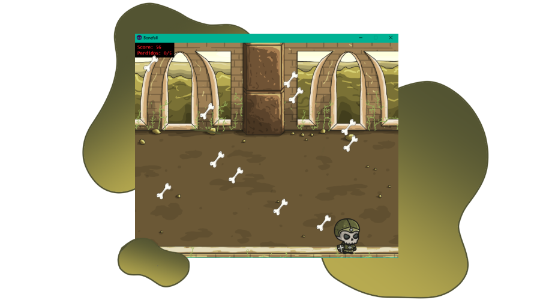

<p align="center">
  
</p>

<p align="center">
  <a href="#-tecnologias">Tecnologias</a>&nbsp;&nbsp;&nbsp;&nbsp;|&nbsp;&nbsp;&nbsp;&nbsp;
  <a href="#-projeto">Projeto</a>&nbsp;&nbsp;&nbsp;&nbsp;|&nbsp;&nbsp;&nbsp;&nbsp;
  <a href="#-como-rodar">Como rodar</a>&nbsp;&nbsp;&nbsp;&nbsp;
</p>

<p align="center">
  
</p>

## 💻 Tecnologias

Liguagens e bibliotecas 

- Python
- Pygame
- SQLite3

## 🚀 Projeto

Bonefall é um jogo desenvolvido com Python e Pygame, onde você assume o papel de um necromante em um cenário caótico 
de ossos que caem do céu. À medida que o jogo avança, a velocidade do colapso de ossos aumenta,
tornando o jogo cada vez mais desafiador. O objetivo do jogo é coletar o máximo de ossos possível. 
Você pode deixar no máximo 5 ossos passarem para o lado sem pegá-los. 

Projeto criado para o componente curricular de Linguagem de Programação Aplicada no curso de ADS da Uninter.

### Controles

- Seta para a direita → Move o necromante para a direita.
- Seta para a esquerda → Move o necromante para a esquerda.
- Enter → Acessa o menu de opções.

## ⚙ Como rodar

### ⚙ Localmente
Clone o repositório com o comando:
``` bash
git clone https://github.com/alt-jams/Bonefall.git 
```
Entre no projeto:
``` bash
cd Bonefall
```
Instale as dependencias com o comando:
``` bash
pip install -r requirements.txt
```

<p align="center">Have fun</p>
<p align="center">Have fun</p>
<p align="center">
    💜
</p>
